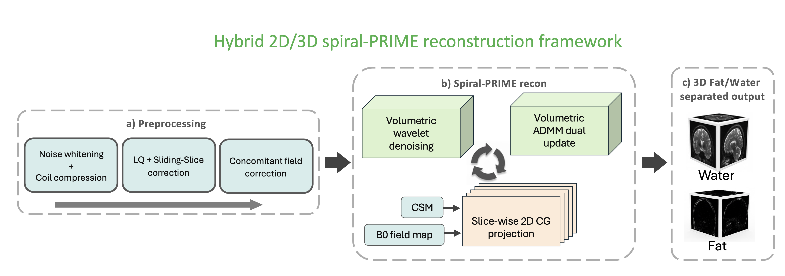
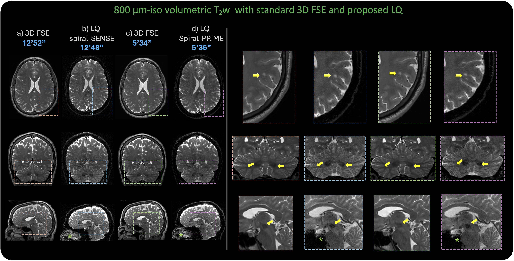

# Spiral-PRIME

Spiral-PRIME: Physics-based Reconstruction with Iterative Model-based Enhancement

Spiral-PRIME is a hybrid 2D/3D reconstruction framework designed  for localized quadratic (LQ) RF encoded spin-echo imaging. It is implemented within the Graphical Programming Interface (GPI) environment to provide high-resolution volumetric brain MRI using spiral trajectories as a clinically viable alternative to 3D Fast Spin-Echo (FSE).

**Key Features**

- **Hybrid 2D/3D Reconstruction:** Joint spiral deblurring, fat-water separation, and 3D wavelet-based noise suppression within a unified ADMM optimization.

**Reconstruction Architecture**

The Spiral-PRIME reconstruction is built on the Graphical Programming Interface (GPI) framework. It solves the following inverse problem using the Alternating Direction Method of Multipliers (ADMM):

$$
\min_{x} \frac{1}{2}\|\tilde{E}x-d\|_{2}^{2} + \sum_{c\in\{w,f\}} \lambda_{c} \|\Psi x_{c}\|_{1}
$$

Where $\tilde{E}$ is the forward operator, $x$ contains the water and fat images, and $\Psi$ represents the 3D wavelet transform.

Figure 3: Schematic of the Spiral-PRIME reconstruction framework.



- (a) Preprocessing includes noise whitening, coil compression, LQ + sliding-slice correction, and concomitant field correction.
- (b) The iterative ADMM loop performs slice-wise data consistency via conjugate gradient and volumetric 3D wavelet denoising.

**System Requirements**

- **Operating System:** macOS is required for compatibility with the GPI implementation used in this study.
- **Hardware:** Developed and validated on Apple Silicon (M2 Pro).
- **Software:** GPI Framework must be installed (https://github.com/gpilab/framework).
- **Compilers:** A C++ compiler is necessary for multi-threaded slice processing.

**Installation and Build**

Clone the repository (development branch):

```bash
git clone -b develop https://github.com/gpilab/spiral-prime.git
```

Navigate to project folder:

```bash
cd spiral-prime
```

Build the code using the GPI build utility:

```bash
gpi_make
```

(Note: active development is on the `develop` branch; stable releases will be pushed to `main`.)

**Results**

Spiral-PRIME achieves consistent T2w SNR gains of 30–40% compared to linear spiral-SENSE reconstructions while preserving fine structural fidelity at $800\,\mu\text{m}$ isotropic resolution.

Figure 5: Accelerated T2w results comparing spiral-SENSE and Spiral-PRIME, highlighting significant noise suppression and artifact mitigation.



**Citation**

If you use this framework or the provided data, please cite:

Krishnamoorthy G, Velikina JV, Pipe JG. Localized Quadratic RF encoded Spin-Echo with Spiral-PRIME Reconstruction: A Practical Alternative to 3D FSE for High-Resolution Volumetric Brain MRI. Magnetic Resonance in Medicine (2026)

---

For more details about implementation and the GPI-based reconstruction pipeline, see the source files in `src/` and the GPI build outputs in the `build/` directory.